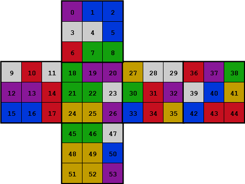

# Overview

`rubot` is a blazing fast Rubik's cube solver written in C. Using  a highly efficient 1MB lookup table, it delivers instantations solutions with an average of 32 moves and a max of 46 moves.

# Installation

Build the executable `rubot` from source by running `make`.

# Usage

## Solve a Color Representation

`rubot` takes a color representation of a cube, and returns a sequence of moves to solve it.

```
$ ./rubot PBBWWBRGGWRWPPRBBRGPPGGWYYPYWWGRPBRYRPGWBYBRRGGWYYBYYP
D' F' R L' U R L F R2 U2 F L R2 D2 R2 F U2 F R2 B2 D2 B U2 R2 U2 F2 R2 U2 F2 U2 L2 B2 L2 U2
```

The colors of a cube are represented by a 54-character string: 6 substings (one per face) of 9 characters (one per color). It does not matter which characters are used to represent each color, as long as they are consistent. The faces are arranged in the order U, L, F, R, B, D, and the tiles in each face are arranged in row-major order. The figure below depicts the index of each tile in the string representation.

<p align="center"></p>

## Solve a Scramble Sequence

`rubot` also takes a sequence of moves used to scramble a solved cube, and returns a sequence of moves to solve it. It does not simply reverse this sequence to produce a solution.
```
$ ./rubot L D2 R L\' R\' B F D L\' U\'
U L D U2 F' B' R D2 R' U2 F2 R2 F2 B2 R2 F2 D2 F2 B2
```

## Generate a Scramble Sequence

`rubot` can also generate a random sequence of non-redundant moves for scrambling a solved cube. Pass it an integer for the number of moves to generate, optionally followed by a second integer to seed the RNG for deterministic results.

## Database Generation

## Optional Flags

`rubot` can take one of four flags as its first argument:

- `-h`/`--help`: Prints the help screen.
- `-c`: Prints the 54-character string representation of the cube.
- `-g`: Displays the cube as an ANSII graphic. This is useful for visualizing the cube.
- `-b`: Runs a benchmark by taking an integer argument and solving that many scrambled cubes, then prints a summary of the results.

<!-- TODO:
# Performance

```
$ ./rubot -b 250000
Throughput: 4585.70 solves per second
Length: 32.19 moves per solve
```
 -->

# How It Works

*NOTE: This is a very high-level overview of a beautiful group theory algorithm, and really does not do it justice beyond setting up a motivation for implementation details. The interested reader should absolutely do further research and investigate the code for more information.*

This program implements [Thistletwaite's algorithm](https://en.wikipedia.org/wiki/Optimal_solutions_for_Rubik%27s_Cube#Thistlethwaite's_algorithm) to solve Rubik's cubes because it provides an optimal compromise between solution length and memory. The algorithm divides the solving process into four phases, each with an increasingly restrictive moveset to prevent destroying progress made in a previous phase. The state space of possible cubes in each phase is relatively small, so we can explore it once and store it in a lookup table. Then when presented with a new cube, we simply lookup the next move in the lookup table for each phase until we arrive at the solved cube.

<!-- TODO: elaborate
- To achieve maximum performance, we encode cubes into 128-bits. This is critical because generating the lookup table requires exploring approximately 50 million cube states.

- To achieve maximum memory efficiency, we encode two enties per byte in the lookup table. This is possible because the depth cannot exceed 15 for any phase, so it can be encoded into 4 bits.

- other implementation details.
 -->
<!-- TODO: make pretty
# References

1. https://www.jaapsch.net/puzzles/thistle.htm

1. https://www.stefan-pochmann.info/spocc/other_stuff/tools/solver_thistlethwaite/solver_thistlethwaite_cpp.txt

1. https://www.stefan-pochmann.info/spocc/other_stuff/tools/solver_thistlethwaite/solver_thistlethwaite.txt

1. https://medium.com/@benjamin.botto/implementing-an-optimal-rubiks-cube-solver-using-korf-s-algorithm-bf750b332cf9

1. https://medium.com/@benjamin.botto/sequentially-indexing-permutations-a-linear-algorithm-for-computing-lexicographic-rank-a22220ffd6e3

1. https://stackoverflow.com/a/3143594/14043949

1. https://stackoverflow.com/a/66608800/14043949
 -->
