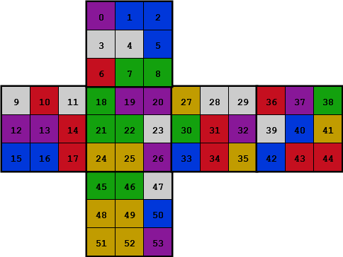

# Overview

`rubot` is a blazing fast Rubik's cube library written in C. It uses a highly efficient 1MB lookup table to deliver instantations solutions with an average of 32 moves and a max of 46 moves.

# Installation

Build the executable `rubot` by running `make`.

# Usage

For a full list of commands, check `rubot -h`.


## Color Strings

`rubot` serializes cube states into color strings. A color string is 54 characters long, and is encoded as 6 substrings (one per face) of 9 characters (one per tile). The faces are arranged in the order U, L, F, R, B, D, and the tiles in each face are arranged in row-major order. It does not matter what characters are used for each color, as long as they are consistent. The figure below depicts the index of each tile in a color string:

<p align="center"></p>

## Cube Solving

`rubot` can take a scrambled cube and return a solution sequence in one of two ways:
- From a color string:
    ```
    $ ./rubot PBBWWBRGGWRWPPRBBRGPPGGWYYPYWWGRPBRYRPGWBYBRRGGWYYBYYP
    Di Fi R Li U R L F R2 U2 F L R2 D2 R2 F U2 F R2 B2 D2 B U2 R2 U2 F2 R2 U2 F2 U2 L2 B2 L2 U2
    ```
- From a scramble sequence: 
    ```
    $ ./rubot L D2 R Li Ri B F D Li Ui
    U L D U2 Fi Bi R D2 Ri U2 F2 R2 F2 B2 R2 F2 D2 F2 B2
    ```

`rubot` can also print the state of the scrambled cube using one of two flags:
- (`-c`) print the color string:
    ```
    $ ./rubot -c L D2 R Li Ri B F D Li Ui
    LURRURDBUUBRLLBUUBFDBLFFLLFLDDURDDFFBRFFBUULRDDLBDRBFR
    ```

- (`-d`) draw an ANSII graphic:
    ```
    $ ./rubot -d LURRURDBUUBRLLBUUBFDBLFFLLFLDDURDDFFBRFFBUULRDDLBDRBFR
    TODO
    ```

## Cube Scrambling

`rubot` also provides functionality for generating random scramble sequences.

- Pass the number of moves to generate, optionally followed by an RNG seed:
    ```
    $ ./rubot 25 5
    D2 U Fi B D F Ui Fi Ui F2 D B Fi D2 U Ri Bi F R L2 B2 Di B Ui Bi
    ```

- As with cube solving, we can use the `-c` or `-d` flag to print the state of the scrambled cube:
    ```
    $ ./rubot -c 1000
    URBFULFDULLRULRLDBUBLFFBRBDFUDLRDRUDLDBFBFFUDURBLDBFRR
    ```

## Performance Benchmarking

`rubot` can even run a performance benchmark by solving a large number of cubes.

- (`-b N`) benchmark on `N` scrambled cubes (output from my i7-13700K):
    ```
    $ ./rubot -b 250000
    Throughput: 4585.70 solves per second
    Length: 32.19 moves per solve
    ```

# How It Works

*NOTE: This is a very high-level overview of a beautiful group theory algorithm, and really does not do it justice beyond setting up a motivation for implementation details. The interested reader should absolutely do further research and investigate the code for more information.*

This program implements [Thistletwaite's algorithm](https://en.wikipedia.org/wiki/Optimal_solutions_for_Rubik%27s_Cube#Thistlethwaite's_algorithm) to solve Rubik's cubes because it provides an optimal compromise between solution length and memory. The algorithm divides the solving process into four phases, each with an increasingly restrictive moveset to prevent destroying progress made in a previous phase. The state space of possible cubes in each phase is relatively small, so we can explore it once and store it in a lookup table. Then when presented with a new cube, we simply lookup the next move in the lookup table for each phase until we arrive at the solved cube.

<!-- TODO: elaborate
- To achieve maximum performance, we encode cubes into 128-bits. This is critical because generating the lookup table requires exploring approximately 50 million cube states.

- To achieve maximum memory efficiency, we encode two enties per byte in the lookup table. This is possible because the depth cannot exceed 15 for any phase, so it can be encoded into 4 bits.

- other implementation details.
 -->
<!-- TODO: make pretty
# References

1. https://www.jaapsch.net/puzzles/thistle.htm

1. https://www.stefan-pochmann.info/spocc/other_stuff/tools/solver_thistlethwaite/solver_thistlethwaite_cpp.txt

1. https://www.stefan-pochmann.info/spocc/other_stuff/tools/solver_thistlethwaite/solver_thistlethwaite.txt

1. https://medium.com/@benjamin.botto/implementing-an-optimal-rubiks-cube-solver-using-korf-s-algorithm-bf750b332cf9

1. https://medium.com/@benjamin.botto/sequentially-indexing-permutations-a-linear-algorithm-for-computing-lexicographic-rank-a22220ffd6e3

1. https://stackoverflow.com/a/3143594/14043949

1. https://stackoverflow.com/a/66608800/14043949
 -->
